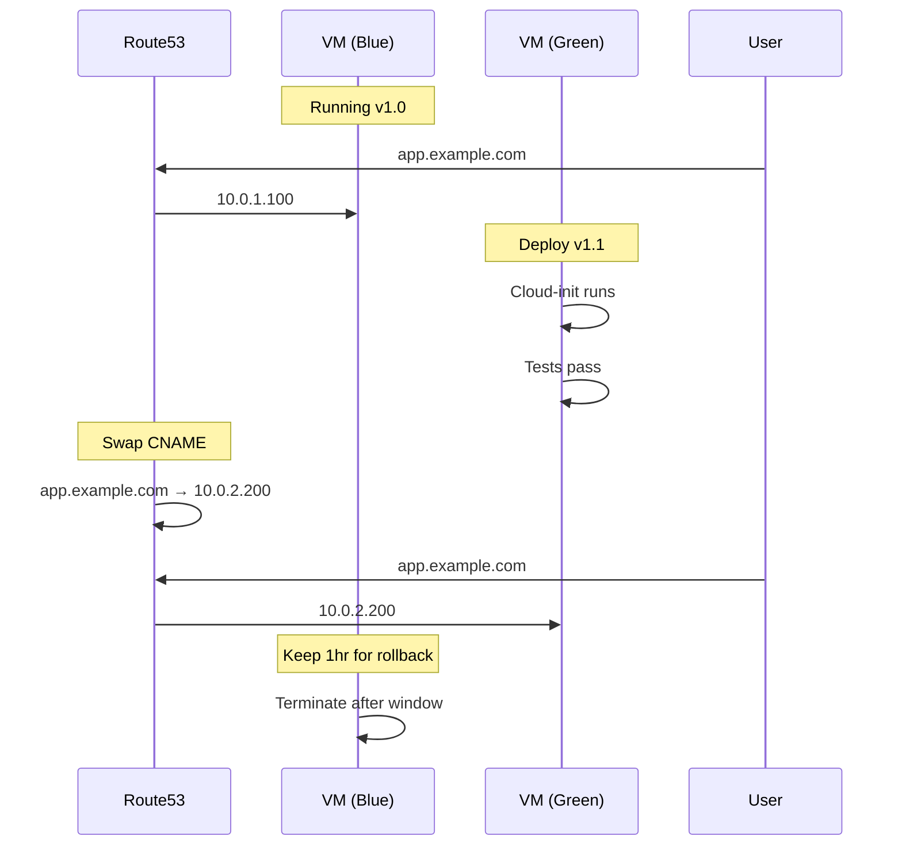

# Deployment Strategy Analysis: Native vs Containers

Analysis of deployment approaches for Ubuntu VMs in the goloo ecosystem.

## Executive Summary

**Recommendation: Native Installation with Deb Packages + CNAME Swap**

For goloo's use case (development VMs that may move to production), native installation with custom deb packages provides the simplest path with the least operational overhead. The CNAME swap strategy for updates eliminates most update complexity by treating VMs as immutable infrastructure.

---

## Two Approaches Analyzed

### Option A: Native Software Installation (Deb Packages)

Install all software components directly on Ubuntu using apt and custom deb packages.

### Option B: Containers with Podman Compose

Run software components as containers orchestrated by Podman Compose.

---

## Comparison Matrix

| Aspect | Native (Deb) | Containers (Podman) |
|--------|--------------|---------------------|
| Initial Creation | Simple (cloud-init + apt) | Moderate (cloud-init + podman + compose) |
| Update Mechanism | apt upgrade / CNAME swap | Image pull / CNAME swap |
| Rollback | New VM + CNAME swap | Previous image tag / New VM |
| Resource Overhead | None | Minimal (~2-5%) |
| Dependency Isolation | None (shared libs) | Full isolation |
| Learning Curve | Familiar for Linux admins | Requires container knowledge |
| Debugging | Direct system access | Container logs + exec |
| Systemd Integration | Native | Via Quadlets or generated units |
| Security Updates | unattended-upgrades | podman auto-update |

---

## Option A: Native Installation (Detailed)

### How It Works

```
cloud-init.yaml
    │
    ├─► apt install from Ubuntu repos
    ├─► apt install from custom PPA/repo
    └─► systemd services started
```

### Initial Creation

Cloud-init handles everything:

```yaml
#cloud-config
package_update: true
packages:
  - nginx
  - postgresql-16
  - my-custom-app  # From custom repo

apt:
  sources:
    my-repo:
      source: "deb https://repo.example.com/apt stable main"
      keyid: ABC123...

runcmd:
  - systemctl enable --now my-custom-app
```

### Update Strategy

**For Security Updates:**
- Ubuntu's [unattended-upgrades](https://documentation.ubuntu.com/server/how-to/software/automatic-updates/) handles this automatically
- Pre-installed and enabled by default on Ubuntu
- Configure in `/etc/apt/apt.conf.d/50unattended-upgrades`
- Can exclude specific packages (databases, kernels) from auto-update
- Supports automatic reboots at scheduled times

```bash
# /etc/apt/apt.conf.d/50unattended-upgrades
Unattended-Upgrade::Allowed-Origins {
    "${distro_id}:${distro_codename}-security";
};
Unattended-Upgrade::Automatic-Reboot "true";
Unattended-Upgrade::Automatic-Reboot-Time "03:00";
```

**For Application Updates:**

Two strategies:

1. **In-place upgrade** (simple changes):
   ```bash
   apt update && apt upgrade my-custom-app
   systemctl restart my-custom-app
   ```

2. **CNAME swap** (major changes or zero-downtime):
   ```
   ┌─────────────────────────────────────────────────────┐
   │  1. Create new VM (green) with updated software    │
   │  2. Test green VM                                   │
   │  3. Swap CNAME: app.example.com → green VM IP      │
   │  4. Keep blue VM for 1 hour (rollback window)      │
   │  5. Terminate blue VM                              │
   └─────────────────────────────────────────────────────┘
   ```

### Creating Custom Deb Packages

For proprietary software, create deb packages and host in a private apt repository:

1. **Package creation** using [debhelper/dh-make](https://earthly.dev/blog/creating-and-hosting-your-own-deb-packages-and-apt-repo/)
2. **Repository hosting** via [reprepro](https://wiki.debian.org/DebianRepository/Setup) on S3/R2/nginx
3. **GPG signing** for security

```bash
# Build package
dpkg-buildpackage -us -uc

# Add to repo
reprepro -b /var/repo includedeb stable myapp_1.0.0_amd64.deb
```

### Pros

- **Simplicity**: No abstraction layer, direct system access
- **Familiar tooling**: apt, systemctl, journalctl
- **Cloud-init native**: Perfect fit with goloo's cloud-init approach
- **Automatic security**: unattended-upgrades handles CVEs
- **Low overhead**: No container runtime, no image layers
- **Easy debugging**: SSH in, inspect directly

### Cons

- **Dependency conflicts**: Possible if apps need different library versions
- **Rollback complexity**: Requires VM replacement or package pinning
- **Configuration drift**: Long-lived VMs may diverge from template
- **Testing updates**: Need staging environment or brave production updates

---

## Option B: Containers with Podman Compose (Detailed)

### How It Works

```
cloud-init.yaml
    │
    ├─► apt install podman podman-compose
    ├─► Copy compose.yaml and container configs
    └─► podman-compose up -d
```

### Initial Creation

Cloud-init installs Podman and starts containers:

```yaml
#cloud-config
packages:
  - podman
  - podman-compose

write_files:
  - path: /opt/app/compose.yaml
    content: |
      version: "3"
      services:
        app:
          image: ghcr.io/myorg/myapp:latest
          ports:
            - "8080:8080"
          labels:
            io.containers.autoupdate: registry
        db:
          image: postgres:16
          volumes:
            - db-data:/var/lib/postgresql/data

runcmd:
  - cd /opt/app && podman-compose up -d
```

### Update Strategy

**For Container Images:**

[Podman auto-update](https://docs.podman.io/en/latest/markdown/podman-auto-update.1.html) can automatically pull new images:

```bash
# Enable the timer
systemctl enable --now podman-auto-update.timer

# Or run manually
podman auto-update
```

Containers must have the label `io.containers.autoupdate=registry` and use fully-qualified image names.

**Modern Approach with Quadlets:**

[Podman Quadlets](https://blog.hofstede.it/production-grade-container-deployment-with-podman-quadlets/) integrate directly with systemd:

```ini
# /etc/containers/systemd/myapp.container
[Container]
Image=ghcr.io/myorg/myapp:latest
PublishPort=8080:8080
Label=io.containers.autoupdate=registry

[Service]
Restart=always

[Install]
WantedBy=default.target
```

**Rollback:**
- Automatic rollback if container fails health check
- Manual: `podman pull myapp:previous-tag && podman-compose up -d`

**CNAME swap** also works and may be preferred for production:
- Build new VM with updated compose.yaml/images
- Test
- Swap DNS
- Terminate old VM

### Pros

- **Isolation**: Each service in its own container, no dependency conflicts
- **Reproducibility**: Same image runs anywhere
- **Easy rollback**: Just pull previous tag
- **Version pinning**: Explicit image tags prevent surprise updates
- **Local testing**: Test exact same containers on dev machine
- **Auto-update**: Built-in image update mechanism with rollback

### Cons

- **Extra complexity**: Another layer to understand and debug
- **Podman on Ubuntu**: Not default, needs installation
- **Networking**: Container networking adds complexity
- **Persistent data**: Volumes need careful management
- **Learning curve**: Team needs container expertise
- **Resource overhead**: ~2-5% CPU/memory for container runtime
- **[Not ideal for multi-node](https://www.kevsrobots.com/learn/podman/10_podman_in_production)**: Podman lacks swarm-like orchestration

---

## The CNAME Swap Strategy (Both Options)

This is the key simplification that makes either option viable.

### Blue-Green with DNS



### Benefits

- **Zero-downtime updates**: New VM ready before cutover
- **Instant rollback**: Point DNS back to old VM
- **Clean state**: Every deploy is a fresh VM, no drift
- **Testable**: Validate new VM before exposing to traffic
- **Simple**: No complex update orchestration

### Considerations

From the [AWS documentation](https://docs.aws.amazon.com/whitepapers/latest/blue-green-deployments/update-dns-routing-with-amazon-route-53.html):

- Set TTL low (60 seconds recommended)
- Internal DNS propagates faster than public DNS
- Some clients/browsers ignore TTL (keep old VM available)

### Handling Stateful Data

The [challenge with stateful applications](https://www.freecodecamp.org/news/how-to-manage-blue-green-deployments-on-aws-ecs-with-database-migrations) is data migration.

**Options:**

| Data Type | Strategy |
|-----------|----------|
| Stateless app | No action needed |
| Managed DB (RDS) | VMs share same RDS, no migration |
| DB on VM | Replication, backup/restore, or shared storage |
| File uploads | S3/EFS (external to VM) |
| Caches | Rebuild on new VM (transient) |

**Recommended: Externalize State**

```
┌─────────────────────────────────────────────────────────┐
│                    Architecture                         │
├─────────────────────────────────────────────────────────┤
│                                                         │
│   ┌─────────┐    ┌─────────┐                           │
│   │ Blue VM │    │Green VM │  ◄── Stateless            │
│   └────┬────┘    └────┬────┘                           │
│        │              │                                 │
│        └──────┬───────┘                                │
│               │                                         │
│        ┌──────▼──────┐                                 │
│        │   RDS/DB    │  ◄── Managed, external          │
│        └─────────────┘                                 │
│        ┌─────────────┐                                 │
│        │  S3/EFS     │  ◄── Files external             │
│        └─────────────┘                                 │
│                                                         │
└─────────────────────────────────────────────────────────┘
```

For DB on VM (dev environments), use backup/restore:

```bash
# On blue VM
pg_dump mydb > /tmp/backup.sql
aws s3 cp /tmp/backup.sql s3://backups/

# On green VM (via cloud-init)
aws s3 cp s3://backups/backup.sql /tmp/
psql mydb < /tmp/backup.sql
```

---

## Recommendation: Native + CNAME Swap

### Why Native Over Containers

For goloo's use case:

1. **Target is Ubuntu-only**: No need for container portability
2. **Cloud-init is already the foundation**: Native packages fit naturally
3. **Simpler debugging**: Direct SSH access, familiar tools
4. **Lower cognitive load**: No container concepts to learn
5. **CNAME swap handles updates**: Eliminates the main advantage of containers (easy rollback)

### When Containers Make Sense

Choose Podman Compose if:
- Running multiple services with conflicting dependencies
- Team already has container expertise
- Need to test exact production config locally
- Services come as container images (no deb packages available)
- Planning to move to Kubernetes later

### Proposed Workflow

```
Development Cycle:

1. Edit cloud-init YAML or update deb package
2. Test locally: goloo create devbox --local
3. Verify: SSH in, run tests
4. Deploy to AWS: goloo create devbox-prod --aws
5. Test green VM
6. Swap CNAME: goloo dns swap devbox-prod
7. Monitor
8. Terminate old VM after 1 hour
```

### Implementation in Goloo

Add DNS swap command to goloo:

```bash
goloo dns swap <name>     # Swap CNAME to current VM
goloo dns rollback <name> # Point back to previous VM
```

Track previous VM IP in config for rollback:

```json
{
  "vm": {
    "name": "devbox-prod",
    "public_ip": "54.1.2.3",
    "previous_ip": "54.1.2.2"
  },
  "dns": {
    "hostname": "app",
    "domain": "example.com"
  }
}
```

---

## Security Considerations

### Native Installation

- Enable [unattended-upgrades](https://help.ubuntu.com/community/AutomaticSecurityUpdates) for security patches
- Consider [Canonical Livepatch](https://ubuntu.com/security/livepatch) for kernel patches without reboot
- Blacklist critical packages (databases) from auto-update
- Use CNAME swap for major updates

### Containers

- Use [Podman's rootless mode](https://betterstack.com/community/guides/scaling-docker/podman-vs-docker/) (default)
- Enable auto-update with health check rollback
- Pin image versions in production
- Scan images for vulnerabilities

---

## Conclusion

| Criterion | Winner |
|-----------|--------|
| Simplicity | Native |
| Operational overhead | Native |
| Dependency isolation | Containers |
| Local/prod parity | Containers |
| Debugging | Native |
| Rollback | Tie (CNAME swap) |
| Update safety | Tie (CNAME swap) |

**Final Recommendation**: Start with native installation. The CNAME swap strategy provides the update safety and rollback capability that would otherwise require containers. If dependency conflicts emerge or services grow complex, containers can be added incrementally for specific components.

---

## Sources

- [Ubuntu Automatic Updates Documentation](https://documentation.ubuntu.com/server/how-to/software/automatic-updates/)
- [Creating and Hosting Deb Packages - Earthly Blog](https://earthly.dev/blog/creating-and-hosting-your-own-deb-packages-and-apt-repo/)
- [Debian Repository Setup](https://wiki.debian.org/DebianRepository/Setup)
- [Podman Auto-Update Documentation](https://docs.podman.io/en/latest/markdown/podman-auto-update.1.html)
- [Podman Quadlets for Production](https://blog.hofstede.it/production-grade-container-deployment-with-podman-quadlets/)
- [Podman in Production](https://www.kevsrobots.com/learn/podman/10_podman_in_production)
- [Blue-Green Deployments with DNS - AWS](https://docs.aws.amazon.com/whitepapers/latest/blue-green-deployments/update-dns-routing-with-amazon-route-53.html)
- [Blue-Green Deployment with Database Migrations](https://www.freecodecamp.org/news/how-to-manage-blue-green-deployments-on-aws-ecs-with-database-migrations)
- [Podman vs Docker 2025](https://betterstack.com/community/guides/scaling-docker/podman-vs-docker/)
