# Goloo Design Document

Unified CLI tool for provisioning VMs locally (Multipass) or in the cloud (AWS) using the same configuration and cloud-init files.

## Problem Statement

Development teams need consistent environments across local machines and cloud infrastructure. Currently:

1. **Local VMs** use Multipass with cloud-init YAML
2. **Cloud VMs** use AWS CLI/Console with the same cloud-init YAML
3. **No unified CLI** bridges these environments with identical configs

The cloud-init format is already portable. The missing piece is a single tool that abstracts provider differences while keeping configs identical.

## Solution

Goloo provides a unified interface:

```bash
goloo create devbox              # Local VM (Multipass)
goloo create devbox --aws        # AWS EC2 instance
```

Same config file, same cloud-init, different targets.

## Core Principle

**One config, any target.** A goloo config file plus a cloud-init YAML should:
1. Create a local VM via `goloo create myvm`
2. Create an identical AWS EC2 instance via `goloo create myvm --aws`

The developer workflow is: develop locally, deploy to cloud with a flag change.

---

## System Architecture

### Block Diagram

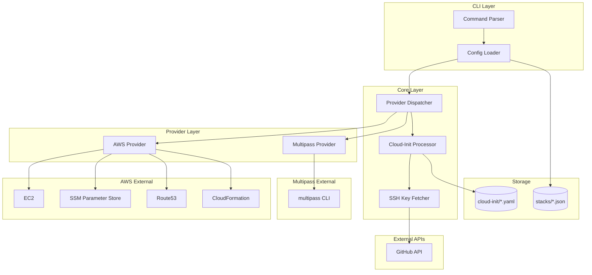

### Component Responsibilities

| Component | Responsibility |
|-----------|----------------|
| Command Parser | Parse CLI flags (`create`, `delete`, `--aws`, etc.) |
| Config Loader | Read JSON configs from `stacks/`, apply defaults, validate |
| Provider Dispatcher | Route to Multipass or AWS based on flags/config |
| Cloud-Init Processor | Substitute `${SSH_PUBLIC_KEY}` variables, validate YAML |
| SSH Key Fetcher | Fetch public keys from `https://github.com/{user}.keys` |
| Multipass Provider | Shell out to `multipass` CLI, parse JSON output |
| AWS Provider | Use AWS SDK for CloudFormation, Route53, SSM, EC2 |

---

## How It Works

### Local VMs (Multipass)

Goloo shells out to `multipass`. The config file translates directly to CLI parameters:

```
goloo config          →    multipass command
─────────────────────────────────────────────
vm.name               →    --name
vm.cpus               →    --cpus
vm.memory             →    --memory
vm.disk               →    --disk
vm.image              →    (positional arg)
vm.cloud_init_file    →    --cloud-init
```

The cloud-init YAML passes through unchanged after SSH key substitution.

### AWS VMs

Goloo uses the AWS Go SDK (based on [aws-ec2](https://github.com/emergingrobotics/aws-ec2)) to:

1. Look up AMI ID via SSM Parameter Store
2. Discover or create VPC/Subnet infrastructure
3. Create CloudFormation stack (EC2 instance + security group)
4. Pass cloud-init YAML as EC2 UserData (base64 encoded)
5. Create Route53 DNS record: `{hostname}.{domain}` → instance IP
6. Update config file with output fields (instance_id, public_ip, etc.)

---

## Data Flow

### VM Creation Sequence (Local)

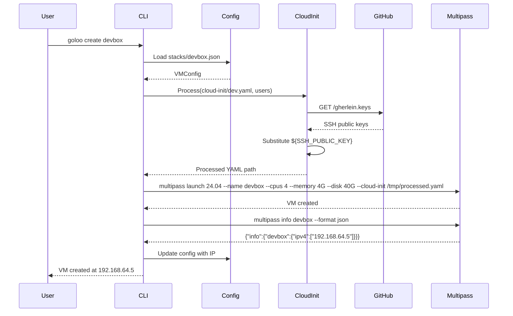

### VM Creation Sequence (AWS)

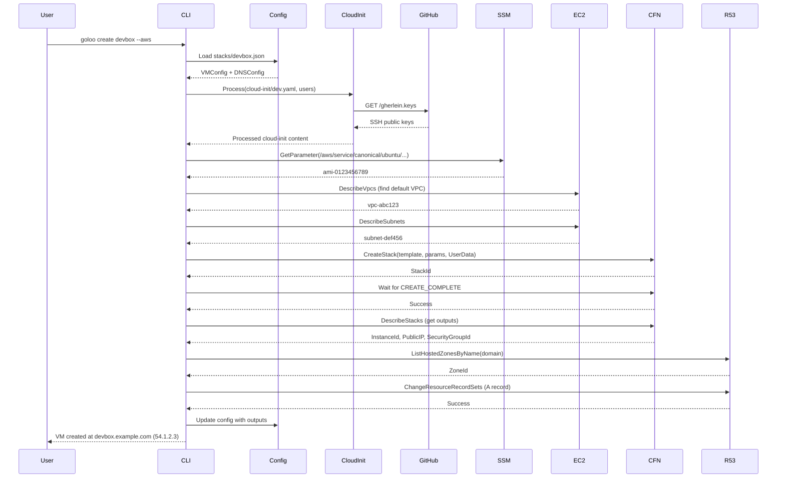

### VM Deletion Sequence

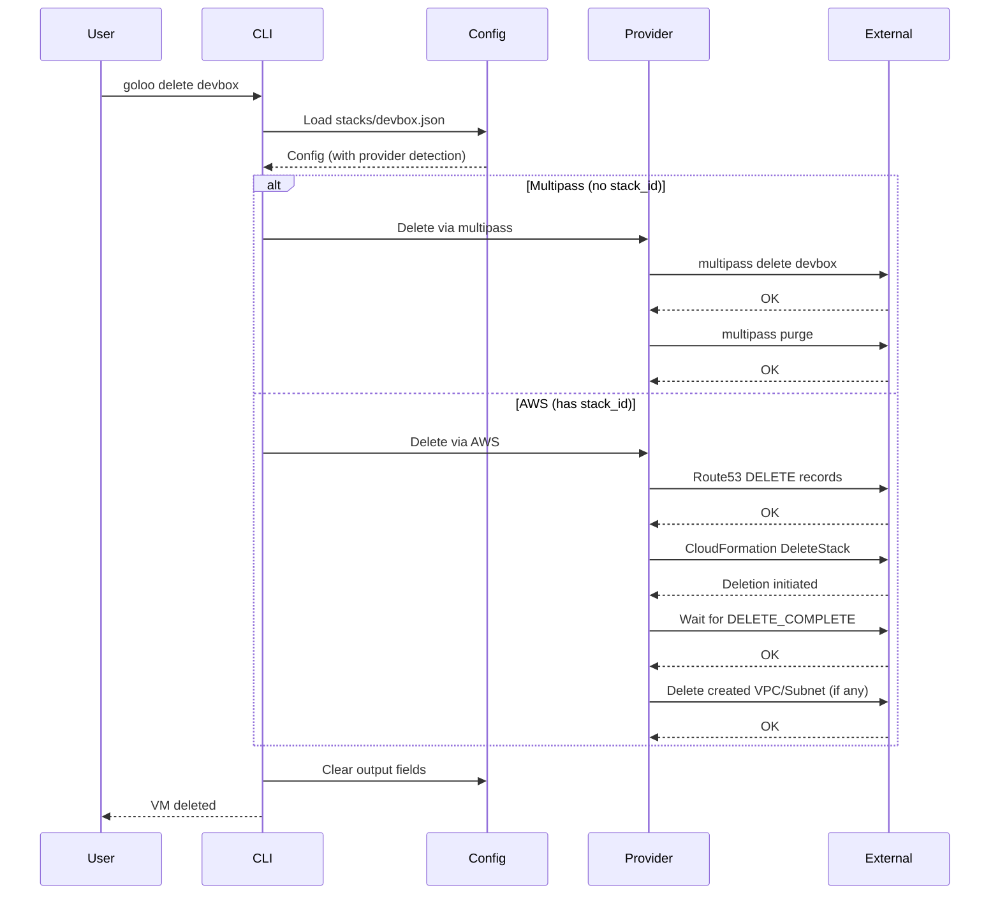

---

## Configuration Schema

### Config File Structure

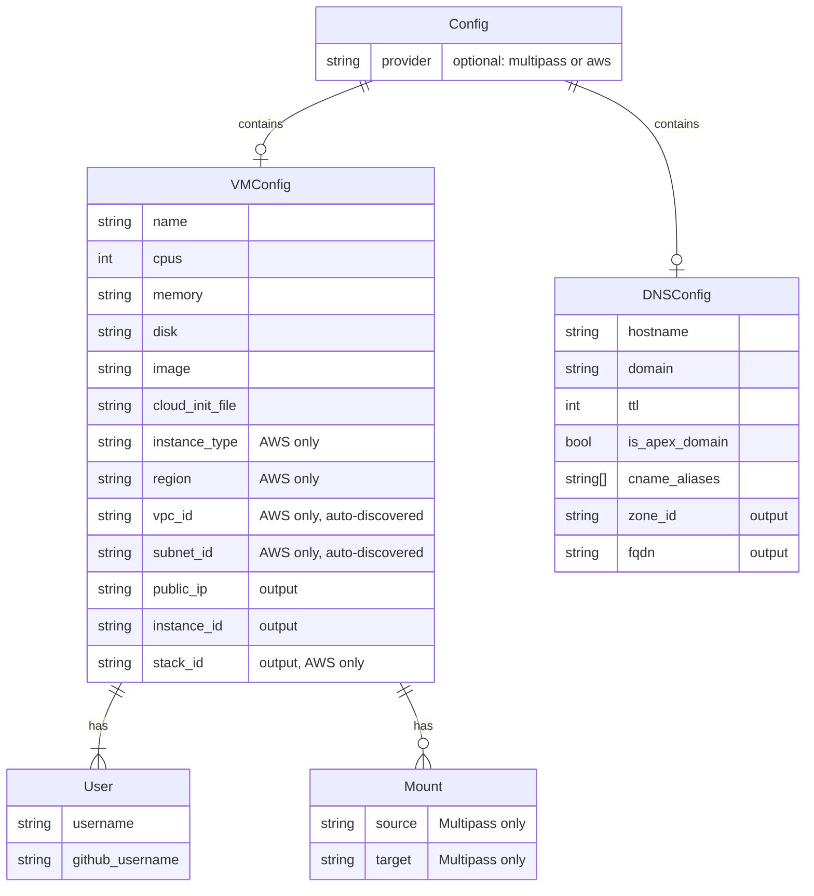

### Example Configs

**Local Development (Multipass):**

```json
{
  "vm": {
    "name": "devbox",
    "cpus": 4,
    "memory": "4G",
    "disk": "40G",
    "image": "24.04",
    "cloud_init_file": "cloud-init/dev.yaml",
    "users": [
      {"username": "ubuntu", "github_username": "gherlein"}
    ],
    "mounts": [
      {"source": "/Users/gherlein/src", "target": "/home/ubuntu/src"}
    ]
  }
}
```

**Cloud Development (AWS):**

```json
{
  "vm": {
    "name": "devbox",
    "instance_type": "t3.medium",
    "os": "ubuntu-24.04",
    "region": "us-west-2",
    "cloud_init_file": "cloud-init/dev.yaml",
    "users": [
      {"username": "ubuntu", "github_username": "gherlein"}
    ]
  },
  "dns": {
    "hostname": "devbox",
    "domain": "example.com",
    "ttl": 300
  }
}
```

**Same Config, Both Targets:**

A single config can work for both (DNS ignored for local):

```json
{
  "vm": {
    "name": "devbox",
    "cpus": 4,
    "memory": "4G",
    "disk": "40G",
    "image": "24.04",
    "instance_type": "t3.medium",
    "os": "ubuntu-24.04",
    "region": "us-west-2",
    "cloud_init_file": "cloud-init/dev.yaml",
    "users": [
      {"username": "ubuntu", "github_username": "gherlein"}
    ]
  },
  "dns": {
    "hostname": "devbox",
    "domain": "example.com",
    "ttl": 300
  }
}
```

---

## Provider Interface

```go
package provider

import (
    "context"
    "time"
)

type VMProvider interface {
    Name() string
    Create(ctx context.Context, cfg *Config, cloudInitPath string) error
    Delete(ctx context.Context, cfg *Config) error
    Status(ctx context.Context, cfg *Config) (*VMStatus, error)
    List(ctx context.Context) ([]VMStatus, error)
    SSH(ctx context.Context, cfg *Config) error
    Stop(ctx context.Context, cfg *Config) error
    Start(ctx context.Context, cfg *Config) error
}

type VMStatus struct {
    Name      string
    State     string    // Running, Stopped, etc.
    IP        string
    Provider  string    // multipass, aws
    CreatedAt time.Time
}
```

### Provider Class Diagram

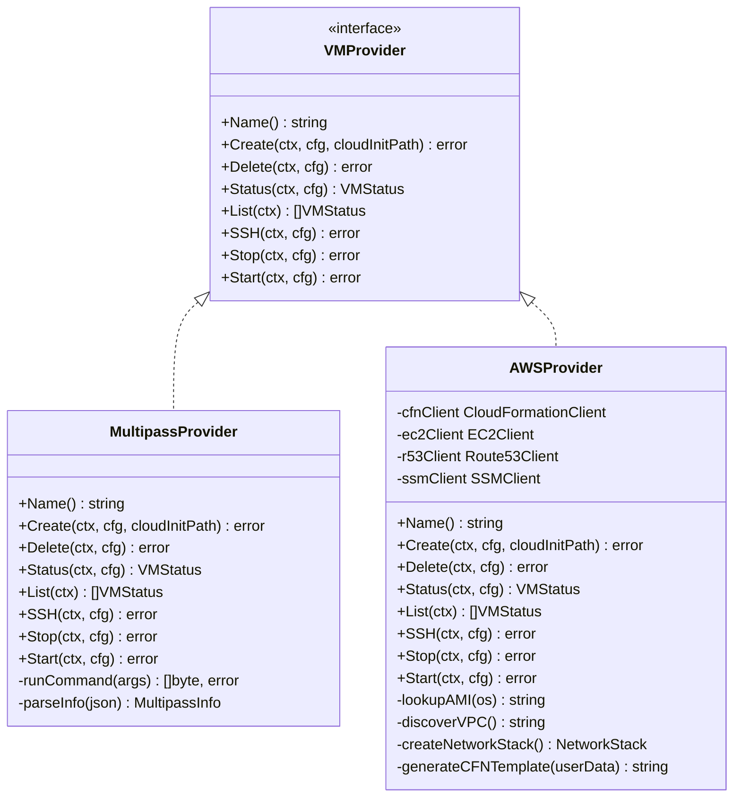

---

## Cloud-Init Processing

### Variable Substitution Flow

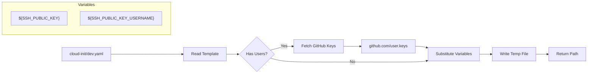

### Supported Variables

| Variable | Source | Description |
|----------|--------|-------------|
| `${SSH_PUBLIC_KEY}` | GitHub | First user's SSH public keys |
| `${SSH_PUBLIC_KEY_<USERNAME>}` | GitHub | Specific user's SSH keys (uppercase) |

### Example Cloud-Init

```yaml
#cloud-config
users:
  - name: ubuntu
    groups: sudo
    shell: /bin/bash
    sudo: ALL=(ALL) NOPASSWD:ALL
    ssh_authorized_keys:
      - ${SSH_PUBLIC_KEY}

packages:
  - git
  - build-essential
  - golang-go

runcmd:
  - echo "Cloud-init complete" > /var/log/goloo-init.log
```

---

## AWS Implementation Details

### CloudFormation Template

Based on [aws-ec2](https://github.com/emergingrobotics/aws-ec2), the generated template includes:

```yaml
AWSTemplateFormatVersion: '2010-09-09'
Description: EC2 instance with SSH access

Parameters:
  ImageId:
    Type: String
  InstanceType:
    Type: String
    Default: t3.micro
  VpcId:
    Type: String
  SubnetId:
    Type: String

Resources:
  SSHSecurityGroup:
    Type: AWS::EC2::SecurityGroup
    Properties:
      GroupDescription: Allow SSH/HTTP/HTTPS
      VpcId: !Ref VpcId
      SecurityGroupIngress:
        - IpProtocol: tcp
          FromPort: 22
          ToPort: 22
          CidrIp: 0.0.0.0/0
        - IpProtocol: tcp
          FromPort: 80
          ToPort: 80
          CidrIp: 0.0.0.0/0
        - IpProtocol: tcp
          FromPort: 443
          ToPort: 443
          CidrIp: 0.0.0.0/0

  EC2Instance:
    Type: AWS::EC2::Instance
    Properties:
      InstanceType: !Ref InstanceType
      ImageId: !Ref ImageId
      NetworkInterfaces:
        - DeviceIndex: "0"
          SubnetId: !Ref SubnetId
          AssociatePublicIpAddress: true
          GroupSet:
            - !GetAtt SSHSecurityGroup.GroupId
      UserData: <base64-encoded-cloud-init>

Outputs:
  InstanceId:
    Value: !Ref EC2Instance
  PublicIP:
    Value: !GetAtt EC2Instance.PublicIp
  SecurityGroupId:
    Value: !Ref SSHSecurityGroup
```

### AMI Lookup via SSM

```go
var osSSMPaths = map[string]string{
    "ubuntu-24.04": "/aws/service/canonical/ubuntu/server/24.04/stable/current/amd64/hvm/ebs-gp2/ami-id",
    "ubuntu-22.04": "/aws/service/canonical/ubuntu/server/22.04/stable/current/amd64/hvm/ebs-gp2/ami-id",
    "amazon-linux-2023": "/aws/service/ami-amazon-linux-latest/al2023-ami-kernel-default-x86_64",
}
```

### VPC/Subnet Discovery

1. Try to find default VPC
2. If no default VPC, find any available VPC
3. If no VPC exists, create network stack (VPC + Subnet + IGW + Route Table)
4. Find subnet with public IP auto-assign, or create one

### DNS Record Creation

1. Look up hosted zone ID for domain
2. Create A record: `hostname.domain` → public IP
3. Optionally create CNAME aliases
4. Optionally create apex domain record

---

## CLI Design

### Command Structure

```
goloo <command> <name> [flags]

Commands:
  create    Create a new VM
  delete    Delete a VM
  status    Show VM status
  list      List all VMs
  ssh       SSH into a VM
  stop      Stop a VM
  start     Start a VM

Flags:
  --aws         Use AWS provider (override config)
  --local       Use Multipass provider (override config)
  --config      Path to config file
  --cloud-init  Override cloud-init file

Backwards Compatibility (aws-ec2 style):
  -c            Shorthand for create
  -d            Shorthand for delete
  -n            Shorthand for name
```

### Provider Selection Logic

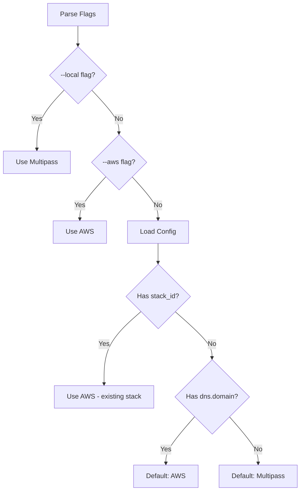

---

## State Management

### Config File Lifecycle

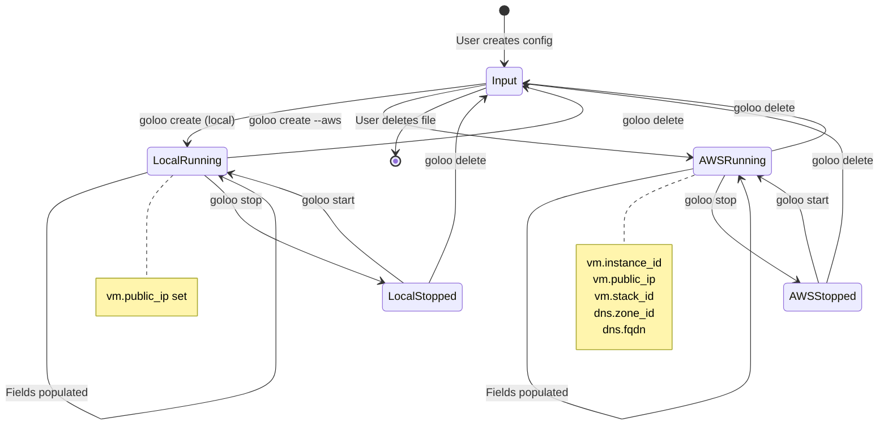

### Output Fields by Provider

| Field | Multipass | AWS |
|-------|-----------|-----|
| `vm.instance_id` | - | EC2 instance ID |
| `vm.public_ip` | Multipass IP | EC2 public IP |
| `vm.stack_id` | - | CloudFormation stack ARN |
| `vm.stack_name` | - | CloudFormation stack name |
| `vm.security_group` | - | Security group ID |
| `vm.ami_id` | - | AMI ID used |
| `vm.vpc_id` | - | VPC ID (discovered/created) |
| `vm.subnet_id` | - | Subnet ID (discovered/created) |
| `dns.zone_id` | - | Route53 zone ID |
| `dns.fqdn` | - | Full DNS name |
| `dns.dns_records` | - | Created DNS records |

---

## Update Strategy: CNAME Swap

For zero-downtime updates, goloo supports blue-green deployment via DNS:

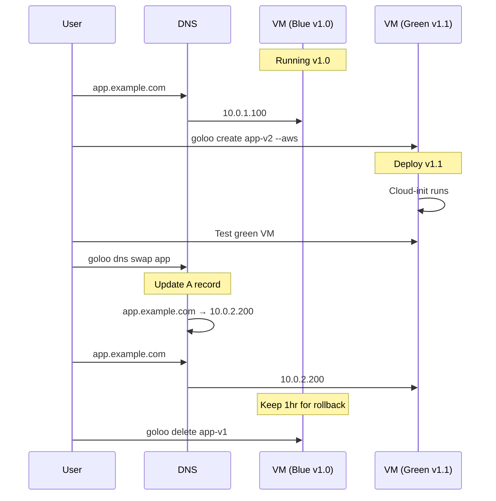

---

## Directory Structure

```
goloo/
├── cmd/goloo/
│   └── main.go              # CLI entry point
├── internal/
│   ├── config/
│   │   ├── config.go        # Config types
│   │   ├── loader.go        # Load, save, validate
│   │   └── loader_test.go
│   ├── cloudinit/
│   │   ├── processor.go     # Variable substitution
│   │   ├── ssh.go           # GitHub key fetching
│   │   └── processor_test.go
│   └── provider/
│       ├── interface.go     # VMProvider interface
│       ├── registry.go      # Provider registry
│       ├── multipass/
│       │   ├── multipass.go # Shell out to multipass
│       │   └── multipass_test.go
│       └── aws/
│           ├── aws.go       # Main provider
│           ├── template.go  # CloudFormation template
│           ├── dns.go       # Route53 operations
│           ├── network.go   # VPC/Subnet discovery
│           └── aws_test.go
├── stacks/                  # Config files (gitignored)
│   └── devbox.json
├── cloud-init/              # Cloud-init templates
│   ├── base.yaml
│   ├── dev.yaml
│   └── claude-dev.yaml
├── Makefile
├── go.mod
├── go.sum
└── README.md
```

---

## Error Handling

### Error Categories

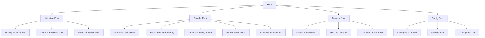

### Error Messages

All errors should be actionable:

```go
var (
    ErrConfigNotFound   = errors.New("config file not found: create stacks/<name>.json")
    ErrProviderUnknown  = errors.New("unknown provider: use 'multipass' or 'aws'")
    ErrVMExists         = errors.New("VM already exists: delete first with 'goloo delete <name>'")
    ErrVMNotFound       = errors.New("VM not found: check 'goloo list' for available VMs")
    ErrNoSSHKeys        = errors.New("no SSH keys found: verify GitHub username at github.com/<user>.keys")
    ErrNoVPC            = errors.New("no VPC found: will create new network infrastructure")
    ErrAWSCredentials   = errors.New("AWS credentials not configured: run 'aws configure'")
    ErrMultipassMissing = errors.New("multipass not installed: visit multipass.run")
)
```

---

## Security Considerations

1. **SSH Keys**: Fetched from GitHub over HTTPS only
2. **AWS Credentials**: Use standard AWS credential chain (env, ~/.aws, IAM role)
3. **Config Files**: May contain sensitive data - gitignored by default
4. **Cloud-Init**: Runs as root - review templates carefully
5. **Security Groups**: SSH open to 0.0.0.0/0 by default - restrict for production
6. **DNS TTL**: Set low (60-300s) to enable quick CNAME swaps

---

## Dependencies

### Go Modules

```go
require (
    github.com/aws/aws-sdk-go-v2 v1.x
    github.com/aws/aws-sdk-go-v2/config v1.x
    github.com/aws/aws-sdk-go-v2/service/cloudformation v1.x
    github.com/aws/aws-sdk-go-v2/service/ec2 v1.x
    github.com/aws/aws-sdk-go-v2/service/route53 v1.x
    github.com/aws/aws-sdk-go-v2/service/ssm v1.x
)
```

### External Dependencies

| Dependency | Required For |
|------------|--------------|
| `multipass` CLI | Local VMs |
| AWS credentials | AWS provider |
| Internet access | GitHub SSH keys, AWS API |

---

## References

- [Multipass Documentation](https://multipass.run/)
- [cloud-init Documentation](https://cloudinit.readthedocs.io/)
- [AWS CloudFormation](https://docs.aws.amazon.com/cloudformation/)
- [aws-ec2 Repository](https://github.com/emergingrobotics/aws-ec2) - Foundation for AWS provider
- [AWS SDK for Go v2](https://aws.github.io/aws-sdk-go-v2/)
