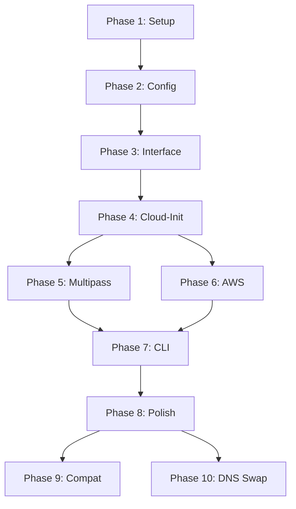

# Goloo Development Plan

Step-by-step implementation plan for building the unified VM provisioning tool.

## Overview

Build goloo by:
1. Creating the project structure and core types
2. Implementing the Multipass provider (shells out to CLI)
3. Porting the AWS provider from [aws-ec2](https://github.com/emergingrobotics/aws-ec2)
4. Unifying with a clean CLI

## Prerequisites

Before starting:

- [ ] Go 1.21+ installed
- [ ] Multipass installed and working (`multipass version`)
- [ ] AWS credentials configured (`aws sts get-caller-identity`)
- [ ] GitHub account (for SSH key testing)

---

## Phase 1: Project Setup

### 1.1 Initialize Repository

```bash
mkdir goloo && cd goloo
go mod init github.com/emergingrobotics/goloo
```

### 1.2 Create Directory Structure

```
goloo/
├── cmd/goloo/
│   └── main.go
├── internal/
│   ├── config/
│   │   ├── config.go
│   │   ├── loader.go
│   │   └── loader_test.go
│   ├── cloudinit/
│   │   ├── processor.go
│   │   ├── ssh.go
│   │   └── processor_test.go
│   └── provider/
│       ├── interface.go
│       ├── registry.go
│       ├── multipass/
│       │   ├── multipass.go
│       │   └── multipass_test.go
│       └── aws/
│           ├── aws.go
│           ├── template.go
│           ├── dns.go
│           ├── network.go
│           └── aws_test.go
├── stacks/
│   └── .gitkeep
├── cloud-init/
│   └── (copy from multipass-stuff/configs/)
├── Makefile
├── go.mod
└── README.md
```

### 1.3 Create Makefile

```makefile
.PHONY: build run-tests clean install lint

BINARY := goloo
VERSION := $(shell git describe --tags --always --dirty 2>/dev/null || echo "dev")
LDFLAGS := -ldflags "-X main.version=$(VERSION)"
INSTALL_DIR ?= $(HOME)/bin

# Default target: show help
help:
	@echo "Usage: make <target>"
	@echo ""
	@echo "Targets:"
	@echo "  build     Build the binary"
	@echo "  run-tests Run all tests"
	@echo "  clean     Remove build artifacts"
	@echo "  install   Install to $(INSTALL_DIR)"
	@echo "  lint      Run linter"

build:
	go build $(LDFLAGS) -o bin/$(BINARY) ./cmd/goloo

run-tests:
	go test -v ./...

clean:
	rm -rf bin/

install: build
	mkdir -p $(INSTALL_DIR)
	cp bin/$(BINARY) $(INSTALL_DIR)/

lint:
	go vet ./...
	@which golangci-lint > /dev/null || echo "Install golangci-lint for more checks"
```

### 1.4 Acceptance Criteria

- [ ] `go build ./...` succeeds
- [ ] `go test ./...` runs (even with no tests yet)
- [ ] `make build` creates `bin/goloo`
- [ ] Directory structure matches plan

---

## Phase 2: Core Types and Config

### 2.1 Define Core Types

Create `internal/config/config.go`:

```go
package config

// Config is the top-level configuration
type Config struct {
    VM  *VMConfig  `json:"vm,omitempty"`
    DNS *DNSConfig `json:"dns,omitempty"`
}

// VMConfig defines VM parameters
type VMConfig struct {
    // Common fields (both providers)
    Name          string  `json:"name"`
    CloudInitFile string  `json:"cloud_init_file,omitempty"`
    Users         []User  `json:"users,omitempty"`

    // Multipass-specific
    CPUs    int     `json:"cpus,omitempty"`
    Memory  string  `json:"memory,omitempty"`
    Disk    string  `json:"disk,omitempty"`
    Image   string  `json:"image,omitempty"`
    Mounts  []Mount `json:"mounts,omitempty"`

    // AWS-specific
    InstanceType string `json:"instance_type,omitempty"`
    OS           string `json:"os,omitempty"`
    Region       string `json:"region,omitempty"`
    VpcID        string `json:"vpc_id,omitempty"`
    SubnetID     string `json:"subnet_id,omitempty"`

    // Output fields (populated after creation)
    PublicIP      string `json:"public_ip,omitempty"`
    InstanceID    string `json:"instance_id,omitempty"`
    StackID       string `json:"stack_id,omitempty"`
    StackName     string `json:"stack_name,omitempty"`
    SecurityGroup string `json:"security_group,omitempty"`
    AMIID         string `json:"ami_id,omitempty"`

    // Network tracking (for cleanup)
    CreatedVPC            bool   `json:"created_vpc,omitempty"`
    CreatedSubnet         bool   `json:"created_subnet,omitempty"`
    InternetGatewayID     string `json:"internet_gateway_id,omitempty"`
    RouteTableID          string `json:"route_table_id,omitempty"`
    RouteTableAssociation string `json:"route_table_association_id,omitempty"`
}

// DNSConfig defines DNS parameters (AWS only)
type DNSConfig struct {
    Hostname     string   `json:"hostname,omitempty"`
    Domain       string   `json:"domain,omitempty"`
    TTL          int      `json:"ttl,omitempty"`
    IsApexDomain bool     `json:"is_apex_domain,omitempty"`
    CNAMEAliases []string `json:"cname_aliases,omitempty"`

    // Output fields
    ZoneID     string      `json:"zone_id,omitempty"`
    FQDN       string      `json:"fqdn,omitempty"`
    DNSRecords []DNSRecord `json:"dns_records,omitempty"`
}

type User struct {
    Username       string `json:"username"`
    GitHubUsername string `json:"github_username"`
}

type Mount struct {
    Source string `json:"source"`
    Target string `json:"target"`
}

type DNSRecord struct {
    Name  string `json:"name"`
    Type  string `json:"type"`
    Value string `json:"value"`
    TTL   int    `json:"ttl"`
}
```

### 2.2 Implement Config Loader

Create `internal/config/loader.go`:

```go
package config

func Load(name string) (*Config, string, error)
func Save(path string, cfg *Config) error
func ResolvePath(name string) string
func ApplyDefaults(cfg *Config)
func Validate(cfg *Config) error
```

Key behaviors:
- Check `stacks/<name>.json` first, then treat as path
- Apply defaults (cpus=2, memory=2G, disk=20G, region=us-east-1)
- Validate required fields (name, at least one user)
- Validate username format (lowercase, starts with letter)

### 2.3 Write Config Tests

Create `internal/config/loader_test.go`:

- Test loading valid config
- Test path resolution (stacks/ prefix)
- Test applying defaults
- Test validation errors (missing name, invalid username)
- Test saving config updates output fields

### 2.4 Acceptance Criteria

- [ ] Can load JSON config from stacks/
- [ ] Defaults applied for missing fields
- [ ] Validation catches missing required fields
- [ ] Validation catches invalid username format
- [ ] All config tests pass

---

## Phase 3: Provider Interface

### 3.1 Define Interface

Create `internal/provider/interface.go`:

```go
package provider

import (
    "context"
    "time"

    "github.com/emergingrobotics/goloo/internal/config"
)

type VMProvider interface {
    Name() string
    Create(ctx context.Context, cfg *config.Config, cloudInitPath string) error
    Delete(ctx context.Context, cfg *config.Config) error
    Status(ctx context.Context, cfg *config.Config) (*VMStatus, error)
    List(ctx context.Context) ([]VMStatus, error)
    SSH(ctx context.Context, cfg *config.Config) error
    Stop(ctx context.Context, cfg *config.Config) error
    Start(ctx context.Context, cfg *config.Config) error
}

type VMStatus struct {
    Name      string
    State     string
    IP        string
    Provider  string
    CreatedAt time.Time
}
```

### 3.2 Create Provider Registry

Create `internal/provider/registry.go`:

```go
package provider

var providers = make(map[string]VMProvider)

func Register(name string, p VMProvider)
func Get(name string) (VMProvider, error)
func List() []string
```

### 3.3 Acceptance Criteria

- [ ] Interface compiles
- [ ] Registry can register and retrieve providers
- [ ] Unknown provider returns clear error

---

## Phase 4: Cloud-Init Processor

### 4.1 Implement SSH Key Fetching

Create `internal/cloudinit/ssh.go`:

```go
package cloudinit

import (
    "fmt"
    "io"
    "net/http"
)

func FetchGitHubKeys(username string) (string, error) {
    url := fmt.Sprintf("https://github.com/%s.keys", username)
    resp, err := http.Get(url)
    // ... handle response, return keys
}
```

### 4.2 Implement Template Processing

Create `internal/cloudinit/processor.go`:

```go
package cloudinit

import "github.com/emergingrobotics/goloo/internal/config"

func Process(templatePath string, users []config.User) (string, error)
```

Processing steps:
1. Read template file
2. For each user, fetch GitHub SSH keys
3. Substitute `${SSH_PUBLIC_KEY}` with first user's keys
4. Substitute `${SSH_PUBLIC_KEY_<USERNAME>}` for specific users (uppercase)
5. Write to temp file
6. Return temp file path

### 4.3 Write Processor Tests

- Test variable substitution with mock keys
- Test GitHub key fetching (use httptest)
- Test missing template file error
- Test empty keys handling

### 4.4 Acceptance Criteria

- [ ] Fetches SSH keys from GitHub
- [ ] Substitutes all variables correctly
- [ ] Returns valid temp file path
- [ ] Handles missing keys gracefully
- [ ] All processor tests pass

---

## Phase 5: Multipass Provider

### 5.1 Implement Provider

Create `internal/provider/multipass/multipass.go`:

```go
package multipass

import (
    "context"
    "encoding/json"
    "os/exec"

    "github.com/emergingrobotics/goloo/internal/config"
    "github.com/emergingrobotics/goloo/internal/provider"
)

type Provider struct{}

func New() *Provider { return &Provider{} }

func (p *Provider) Name() string { return "multipass" }

func (p *Provider) Create(ctx context.Context, cfg *config.Config, cloudInitPath string) error {
    // Build args: launch <image> --name <name> --cpus <cpus> --memory <mem> --disk <disk> --cloud-init <path>
    // Execute: multipass launch ...
    // Get IP: multipass info <name> --format json
    // Update cfg.VM.PublicIP
}

func (p *Provider) Delete(ctx context.Context, cfg *config.Config) error {
    // Execute: multipass delete <name>
    // Execute: multipass purge
}

func (p *Provider) Status(ctx context.Context, cfg *config.Config) (*provider.VMStatus, error) {
    // Execute: multipass info <name> --format json
    // Parse and return status
}

func (p *Provider) List(ctx context.Context) ([]provider.VMStatus, error) {
    // Execute: multipass list --format json
    // Parse and return list
}

func (p *Provider) SSH(ctx context.Context, cfg *config.Config) error {
    // Execute: multipass shell <name> (interactive, replace process)
}

func (p *Provider) Stop(ctx context.Context, cfg *config.Config) error {
    // Execute: multipass stop <name>
}

func (p *Provider) Start(ctx context.Context, cfg *config.Config) error {
    // Execute: multipass start <name>
}
```

### 5.2 Helper Functions

```go
func (p *Provider) runCommand(ctx context.Context, args ...string) ([]byte, error)
func (p *Provider) getInfo(ctx context.Context, name string) (*multipassInfo, error)
func (p *Provider) setupMounts(ctx context.Context, name string, mounts []config.Mount) error
```

### 5.3 Multipass JSON Parsing

```go
type multipassList struct {
    List []multipassVM `json:"list"`
}

type multipassInfo struct {
    Info map[string]multipassVM `json:"info"`
}

type multipassVM struct {
    Name    string   `json:"name"`
    State   string   `json:"state"`
    IPv4    []string `json:"ipv4"`
    Release string   `json:"release"`
}
```

### 5.4 Write Provider Tests

- Test command building
- Test JSON parsing from multipass output
- Test error handling (VM exists, VM not found)

### 5.5 Integration Test Checklist

Manual tests (require multipass):
- [ ] Create VM with cloud-init
- [ ] Verify SSH keys installed
- [ ] Verify packages installed
- [ ] Stop VM
- [ ] Start VM
- [ ] Delete VM

### 5.6 Acceptance Criteria

- [ ] All CRUD operations work
- [ ] Cloud-init executes correctly
- [ ] Mounts work (if specified)
- [ ] Status returns correct info
- [ ] All unit tests pass

---

## Phase 6: AWS Provider

### 6.1 Port from aws-ec2

Adapt code from [aws-ec2](https://github.com/emergingrobotics/aws-ec2) main.go:

| aws-ec2 function | goloo location |
|------------------|----------------|
| `generateCloudFormationTemplate()` | `aws/template.go` |
| `lookupAMI()` | `aws/aws.go` |
| `discoverVPC()`, `discoverSubnet()` | `aws/network.go` |
| `createNetworkStack()`, `deleteNetworkStack()` | `aws/network.go` |
| `createDNSResources()`, DNS functions | `aws/dns.go` |
| `createVMResources()` | `aws/aws.go Create()` |
| `deleteStackNested()` | `aws/aws.go Delete()` |

### 6.2 Create template.go

```go
package aws

const cloudFormationTemplate = `
AWSTemplateFormatVersion: '2010-09-09'
...
`

func generateTemplate(userData string) (string, error)
```

### 6.3 Create network.go

```go
package aws

func (p *Provider) discoverVPC(ctx context.Context) (string, error)
func (p *Provider) discoverSubnet(ctx context.Context, vpcID string) (string, error)
func (p *Provider) createNetworkStack(ctx context.Context, stackName string) (*NetworkStack, error)
func (p *Provider) deleteNetworkStack(ctx context.Context, vm *config.VMConfig) error

type NetworkStack struct {
    VpcID                 string
    SubnetID              string
    InternetGatewayID     string
    RouteTableID          string
    RouteTableAssociation string
}
```

### 6.4 Create dns.go

```go
package aws

func (p *Provider) lookupZoneID(ctx context.Context, domain string) (string, error)
func (p *Provider) createDNSRecords(ctx context.Context, dns *config.DNSConfig, publicIP string) error
func (p *Provider) deleteDNSRecords(ctx context.Context, dns *config.DNSConfig) error
func (p *Provider) createARecord(ctx context.Context, zoneID, name, ip string, ttl int) error
func (p *Provider) createCNAMERecord(ctx context.Context, zoneID, name, target string, ttl int) error
func (p *Provider) deleteARecord(ctx context.Context, zoneID, name, ip string, ttl int) error
func (p *Provider) deleteCNAMERecord(ctx context.Context, zoneID, name, target string, ttl int) error
```

### 6.5 Create aws.go

```go
package aws

import (
    "context"

    "github.com/aws/aws-sdk-go-v2/service/cloudformation"
    "github.com/aws/aws-sdk-go-v2/service/ec2"
    "github.com/aws/aws-sdk-go-v2/service/route53"
    "github.com/aws/aws-sdk-go-v2/service/ssm"
)

type Provider struct {
    cfnClient *cloudformation.Client
    ec2Client *ec2.Client
    r53Client *route53.Client
    ssmClient *ssm.Client
}

func New(ctx context.Context, region string) (*Provider, error)

func (p *Provider) Name() string { return "aws" }

func (p *Provider) Create(ctx context.Context, cfg *config.Config, cloudInitPath string) error {
    // 1. Read and encode cloud-init as base64
    // 2. Look up AMI via SSM
    // 3. Discover or create VPC/Subnet
    // 4. Generate CloudFormation template with UserData
    // 5. Create CloudFormation stack
    // 6. Wait for CREATE_COMPLETE
    // 7. Get outputs (InstanceId, PublicIP, SecurityGroupId)
    // 8. Update cfg.VM with outputs
    // 9. Create DNS records if cfg.DNS exists
    // 10. Update cfg.DNS with outputs
}

func (p *Provider) Delete(ctx context.Context, cfg *config.Config) error {
    // 1. Delete DNS records if exist
    // 2. Delete CloudFormation stack
    // 3. Wait for DELETE_COMPLETE
    // 4. Delete created network resources if any
    // 5. Clear output fields in cfg
}

// ... other methods
```

### 6.6 AMI Lookup

```go
var osSSMPaths = map[string]string{
    "ubuntu-24.04":      "/aws/service/canonical/ubuntu/server/24.04/stable/current/amd64/hvm/ebs-gp2/ami-id",
    "ubuntu-22.04":      "/aws/service/canonical/ubuntu/server/22.04/stable/current/amd64/hvm/ebs-gp2/ami-id",
    "ubuntu-20.04":      "/aws/service/canonical/ubuntu/server/20.04/stable/current/amd64/hvm/ebs-gp2/ami-id",
    "amazon-linux-2023": "/aws/service/ami-amazon-linux-latest/al2023-ami-kernel-default-x86_64",
    "amazon-linux-2":    "/aws/service/ami-amazon-linux-latest/amzn2-ami-hvm-x86_64-gp2",
    "debian-12":         "/aws/service/debian/release/12/latest/amd64",
    "debian-11":         "/aws/service/debian/release/11/latest/amd64",
}

func (p *Provider) lookupAMI(ctx context.Context, osName string) (string, error)
```

### 6.7 Acceptance Criteria

- [ ] All aws-ec2 functionality preserved
- [ ] Implements VMProvider interface
- [ ] VPC/Subnet auto-discovery works
- [ ] Network creation works when no VPC exists
- [ ] DNS operations work
- [ ] Config updates with output fields
- [ ] Cleanup deletes all created resources

---

## Phase 7: CLI Implementation

### 7.1 Create Main Entry Point

Create `cmd/goloo/main.go`:

```go
package main

import (
    "context"
    "flag"
    "fmt"
    "os"

    "github.com/emergingrobotics/goloo/internal/config"
    "github.com/emergingrobotics/goloo/internal/cloudinit"
    "github.com/emergingrobotics/goloo/internal/provider"
    "github.com/emergingrobotics/goloo/internal/provider/multipass"
    "github.com/emergingrobotics/goloo/internal/provider/aws"
)

var version = "dev"

func main() {
    // Register providers
    provider.Register("multipass", multipass.New())
    // AWS registered lazily (needs region)

    // Parse flags and execute
    if err := run(os.Args[1:]); err != nil {
        fmt.Fprintf(os.Stderr, "Error: %v\n", err)
        os.Exit(1)
    }
}

func run(args []string) error {
    // Parse flags
    // Determine command (create, delete, list, ssh, status, stop, start)
    // Load config
    // Determine provider (flag override or auto-detect)
    // Execute command
}
```

### 7.2 Command Implementation

```go
func cmdCreate(ctx context.Context, name string, providerName string) error {
    // 1. Load config
    cfg, configPath, err := config.Load(name)

    // 2. Process cloud-init
    cloudInitPath, err := cloudinit.Process(cfg.VM.CloudInitFile, cfg.VM.Users)
    defer os.Remove(cloudInitPath)

    // 3. Get provider
    p, err := getProvider(ctx, providerName, cfg)

    // 4. Create VM
    err = p.Create(ctx, cfg, cloudInitPath)

    // 5. Save updated config
    err = config.Save(configPath, cfg)

    // 6. Print result
    fmt.Printf("VM created: %s\n", cfg.VM.PublicIP)
    if cfg.DNS != nil && cfg.DNS.FQDN != "" {
        fmt.Printf("DNS: %s\n", cfg.DNS.FQDN)
    }
    fmt.Printf("SSH: ssh %s@%s\n", cfg.VM.Users[0].Username, target)
}

func cmdDelete(ctx context.Context, name string) error
func cmdList(ctx context.Context) error
func cmdSSH(ctx context.Context, name string) error
func cmdStatus(ctx context.Context, name string) error
func cmdStop(ctx context.Context, name string) error
func cmdStart(ctx context.Context, name string) error
```

### 7.3 Flag Handling

```go
type Flags struct {
    // Commands
    Create bool
    Delete bool

    // Provider selection
    AWS   bool
    Local bool

    // Other
    Name      string
    Config    string
    CloudInit string
    Version   bool
}

func parseFlags(args []string) (*Flags, string, error) {
    // Support both styles:
    // New: goloo create devbox --aws
    // Old: goloo -c -n devbox
}
```

### 7.4 Provider Selection Logic

```go
func getProvider(ctx context.Context, override string, cfg *config.Config) (provider.VMProvider, error) {
    // 1. Check explicit flag (--aws, --local)
    if override == "aws" { return aws.New(ctx, region) }
    if override == "multipass" { return multipass.New(), nil }

    // 2. Check existing stack (has stack_id = was created with AWS)
    if cfg.VM.StackID != "" { return aws.New(ctx, cfg.VM.Region) }

    // 3. Check DNS config (dns.domain implies AWS)
    if cfg.DNS != nil && cfg.DNS.Domain != "" { return aws.New(ctx, region) }

    // 4. Default to multipass
    return multipass.New(), nil
}
```

### 7.5 Acceptance Criteria

- [ ] New syntax works: `goloo create name`
- [ ] New syntax with flags: `goloo create name --aws`
- [ ] Old syntax works: `goloo -c -n name`
- [ ] Provider auto-detection works
- [ ] Provider override flags work
- [ ] Help text is clear
- [ ] Errors are user-friendly and actionable

---

## Phase 8: Integration and Polish

### 8.1 End-to-End Testing

Manual test matrix:

| Test | Multipass | AWS |
|------|-----------|-----|
| Create with cloud-init | [ ] | [ ] |
| SSH into VM | [ ] | [ ] |
| Stop VM | [ ] | [ ] |
| Start VM | [ ] | [ ] |
| Delete VM | [ ] | [ ] |
| List VMs | [ ] | [ ] |
| Status check | [ ] | [ ] |
| DNS creation | N/A | [ ] |
| DNS deletion | N/A | [ ] |

### 8.2 Error Messages Review

Ensure all errors are actionable:

```go
// Good
"config file not found: create stacks/devbox.json"
"multipass not installed: visit multipass.run"
"AWS credentials not configured: run 'aws configure'"

// Bad
"file not found"
"provider error"
```

### 8.3 Documentation

- [ ] Update README.md with goloo usage
- [ ] Add examples for each command
- [ ] Document config file format
- [ ] Document cloud-init variables
- [ ] Document provider auto-detection rules

### 8.4 Acceptance Criteria

- [ ] All integration tests pass
- [ ] Error messages are helpful
- [ ] Documentation is complete
- [ ] `make build && make run-tests` passes

---

## Phase 9: Backwards Compatibility

### 9.1 aws-ec2 Compatibility

Ensure existing aws-ec2 users can migrate:

- [ ] Same config file format works
- [ ] Same CLI flags work (`-c -n`, `-d -n`)
- [ ] Same behavior for AWS operations
- [ ] Nested config format supported
- [ ] Legacy flat config format still works

### 9.2 Migration Guide

Document migration steps:

1. Install goloo: `go install github.com/emergingrobotics/goloo/cmd/goloo@latest`
2. Copy existing `stacks/` directory
3. (Optional) Add `"provider": "aws"` to configs for explicitness
4. Replace `ec2` with `goloo` in scripts
5. Test with `--aws` flag to verify

### 9.3 Acceptance Criteria

- [ ] All aws-ec2 example configs work
- [ ] No breaking changes for AWS users
- [ ] Migration guide is clear

---

## Phase 10: DNS Swap Command

### 10.1 Implement `goloo dns swap`

Add a `dns swap` subcommand for blue-green deployments via DNS. This allows users to deploy a new VM, test it, then atomically switch DNS to point at the new instance.

```bash
goloo dns swap <name>
```

Behavior:
1. Load config for `<name>`
2. Read the current A record for `dns.hostname.dns.domain`
3. Update the A record to point at the new instance's `vm.public_ip`
4. Wait for propagation confirmation
5. Update config with new DNS record values

### 10.2 Implementation in dns.go

```go
func (p *Provider) swapDNSRecord(ctx context.Context, dns *config.DNSConfig, newIP string) error {
    // 1. Look up zone ID
    // 2. UPSERT A record with new IP
    // 3. Wait for INSYNC status
    // 4. Update dns config output fields
}
```

### 10.3 CLI Integration

Add to `cmd/goloo/main.go`:

```go
func cmdDNSSwap(ctx context.Context, name string) error {
    // 1. Load config
    // 2. Validate dns section exists
    // 3. Get AWS provider
    // 4. Call swapDNSRecord
    // 5. Save updated config
}
```

### 10.4 Acceptance Criteria

- [ ] `goloo dns swap <name>` updates the A record to the current `vm.public_ip`
- [ ] Returns error if config has no `dns` section
- [ ] Waits for Route53 change to reach INSYNC
- [ ] Config file updated with new DNS record values
- [ ] Unit tests for swap logic pass

---

## Definition of Done

Each phase is complete when:

1. All code compiles without warnings
2. All unit tests pass
3. Integration tests pass (where applicable)
4. Code follows Go conventions (`go fmt`, `go vet`)
5. Documentation is updated
6. Changes are committed with clear message

---

## Test Commands

```bash
# Unit tests
make run-tests

# Build
make build

# Integration test (Multipass)
./bin/goloo create test-mp
./bin/goloo status test-mp
./bin/goloo ssh test-mp
./bin/goloo delete test-mp

# Integration test (AWS)
./bin/goloo create test-aws --aws
./bin/goloo status test-aws
./bin/goloo delete test-aws

# Integration test (legacy syntax)
./bin/goloo -c -n test-legacy
./bin/goloo -d -n test-legacy
```

---

## Risk Mitigation

| Risk | Mitigation |
|------|------------|
| Multipass CLI changes | Pin to tested version, test against multiple versions |
| AWS API changes | Use versioned SDK, pin SDK version |
| Breaking aws-ec2 compat | Extensive testing with existing configs |
| Cloud-init failures | Validate YAML before launch, clear error messages |
| GitHub rate limiting | Cache keys, graceful degradation |
| Network creation fails | Clean up partial resources, clear error messages |

---

## Dependencies Graph



---

## Next Steps After Plan Approval

1. Create goloo repository
2. Begin Phase 1: Project Setup
3. Iterate through phases sequentially
4. Do not proceed to next phase until current phase passes all acceptance criteria
5. All tests must pass before moving forward
